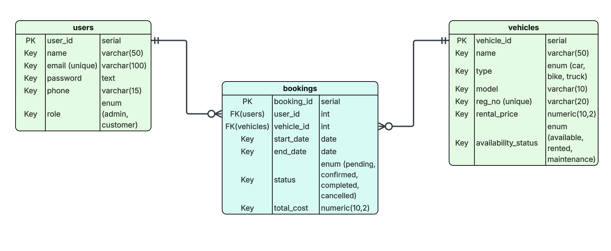

# Vehicle Rental System - Database Project

## 📌 Project Overview

This project implements a **Vehicle Rental System** using a relational database. It is designed to manage users, vehicles, and bookings while enforcing data integrity and proper relationships.

The system allows:

- Users (admins or customers) to be registered with unique emails.
- Vehicles to be tracked with availability and rental pricing.
- Bookings to link users with vehicles and track rental periods, status, and cost.

---

## 📊 Database Schema Overview

### **Users Table**

| Column | Data Type | Constraints |
|--------|-----------|-------------|
| user_id | serial | Primary Key |
| name | varchar(50) | Not Null |
| email | varchar(100) | Not Null, Unique |
| password | text | Not Null (store hashed password) |
| phone | varchar(15) | Optional |
| role | enum('admin','customer') | Not Null |

**Description:** Stores all registered users with role-based differentiation.

---

### **Vehicles Table**

| Column | Data Type | Constraints |
|--------|-----------|-------------|
| vehicle_id | serial | Primary Key |
| name | varchar(50) | Optional |
| type | enum('car','bike','truck') | Not Null |
| model | varchar(10) | Optional |
| reg_no | varchar(20) | Not Null, Unique |
| rental_price | numeric(10,2) | Not Null |
| availability_status | enum('available','rented','maintenance') | Not Null |

**Description:** Stores vehicle information, rental pricing, and current availability status.

---

### **Bookings Table**

| Column | Data Type | Constraints |
|--------|-----------|-------------|
| booking_id | serial | Primary Key |
| user_id | int | Not Null, Foreign Key → users(user_id) |
| vehicle_id | int | Not Null, Foreign Key → vehicles(vehicle_id) |
| start_date | date | Not Null |
| end_date | date | Not Null, Must be after start_date |
| status | enum('pending','confirmed','completed','cancelled') | Not Null |
| total_cost | numeric(10,2) | Not Null |

**Description:** Tracks which user booked which vehicle, the rental period, booking status, and cost.

---

## 📈 Entity Relationship Diagram (ERD)

Your ERD visually represents the relationships:

- **One-to-Many (1:N):** A single user can have multiple bookings.  
- **Many-to-One (N:1):** Many bookings can refer to the same vehicle.  
- **Logical One-to-One:** Each booking links exactly one user to one vehicle.  
- **Primary and Foreign Keys** are clearly defined.  
- Enumerations enforce valid values for roles, vehicle types, vehicle status, and booking status.

**ERD Image:**  

---

## 💾 SQL Queries (Stored in `queries.sql`)

### **Query 1 — Booking Information with JOINs**
Retrieve booking details including the customer and vehicle names  
(Uses `INNER JOIN` between `users`, `bookings`, and `vehicles`)

### **Query 2 — Vehicles Never Booked**
Identify vehicles that have not been referenced in the `bookings` table  
(Uses `NOT EXISTS`)

### **Query 3 — Available Vehicles by Type**
Filter for available vehicles of a specific type like cars  
(Uses `WHERE`)

### **Query 4 — Booking Counts with GROUP BY and HAVING**
Count bookings per vehicle and filter for vehicles with more than two bookings  
(Uses `GROUP BY`, `HAVING`, and `COUNT`)

---

## 📌 Data Integrity and Constraints

- **Unique Constraints:** `email` (users), `reg_no` (vehicles)  
- **Check Constraints:** Role, vehicle type, vehicle status, and booking status  
- **Date Validation:** `end_date` must be after `start_date`  
- **Foreign Keys:** Enforce relationships between users, vehicles, and bookings  

